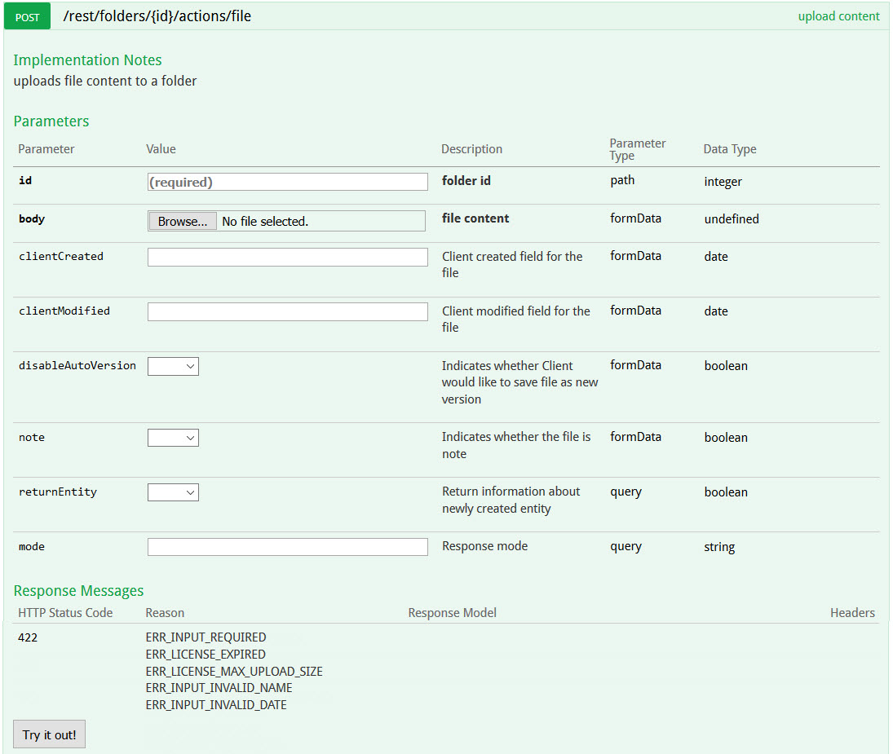
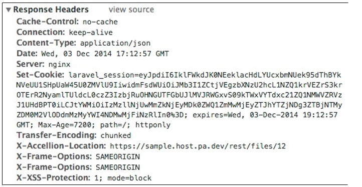

# Adding Files

To add a file to the folder, we need to use the **POST /rest/folders/{id}/actions/file** endpoint under the **files** entity



Here, the id required in the web request is the id of the folder that the file should be added into. In this case, the **id** indicated in the **X-Accellion-Location** field of the response header can be used when we created the folder. The file also needs to be attached, which is done via a multiple MIME request. 

Again, the **id** of the new uploaded file can be found in the **X-Accellion-Location** field of the response header of this request. Note this **id**, because we are going to use it to download this file in the next section. 


Again, the **id** of the new uploaded file can be found in the **X-Accellion-Location** field of the response header of this request. 



## Adding Large Files
The caller can request the APIs to upload or download any kind and size of file successfully under normal conditions. kiteworks can also handle corner cases and report exceptions and errors logically.

### Chunk Upload Workflow
Chunk Upload is aimed to let users upload large files by parts. This section briefly describes the workflow of a chunk upload.

#### Chunk Upload Process Steps
#### Upload session initialization 
The user can upload a new file to a folder or upload a new version of an existing file. To initiate a new file upload call:
**POST /folders/{id}/actions/initiateUpload**
**{id}** - Destination folder ID


To initiate a new file version upload call:
**POST /files/{file_id}/actions/initiateUpload**
**{file_id}** - ID of the file for the file version


If you call **POST /folders/{id}/actions/initiateUpload** with filename that already exists in this directory, the new version of this file will be created.
 
#### Request Body Parameters Description

* filename (required) - Filename that will be created after upload session completion
* totalSize (optional, required if totalChunks was sent) - File size in bytes
* totalChunks (optional, required if totalSize was sent) - Amount of chunks that file is split to

Chunk upload supports two different workflows. The first one requires **totalSize** and **totalChunks**, the second one does not require these fields, but it requires to send **lastChunk field equals to 1 with the last chunk upload (see more details below). The first workflow is preferable since server is able to validate total file content at the end of upload session.

1. To follow first workflow, send all fields listed above.
2. (SFTP Client) The second workflow is meant to be uses by the SFTP client. The SFTP client cannot know the **totalSize** and **totalChunks** when an upload session is initiated. Send only the **filename** if you want to follow this workflow.

If upload initialization was successful, response headers will contain **X-Accellion-Location** field with upload id value. For example:
**{ ..., "X-Accellion-Location": "http://homeurl.com/rest/uploads/1", ... }**
Where **1** is an upload session ID. Use this ID to perform all further operations.


#### Retrieve Upload Session Data

After initialization each upload session will have assigned an "uri" parameter. This parameter contains uri where all chunks for this upload session should be uploaded. To retrieve this parameter call:
**GET /uploads/{id}**

**Response Body Parameters Description**  
**userId** - Upload session owner user ID  
**timestamp** - Upload session creation date.  
**totalSize** - Total size of the file which was set in upload session initialization.  
**totalChunks** - Amount of expected chunks amount, which was set in upload session initialization.  
**clientCookie** - Client cookie field.  
**clientName** - Client ID which is assigned to upload session owner.  
**svrUploadTime** - Amount of time in milliseconds that was spent on uploading all uploaded file chunks.  
**error** - Last error message of the chunk upload, if any.  
**completeOk** - Boolean flag, equals to 0 if session is not completed (not all chunks was uploaded). Equals to 1 if upload session is finished. But since upload session is deleted after successful finish, this parameter will always be equal to 0 if upload session exists.  
**uri** - Uri where all chunks for this upload session should be uploaded.   
Format of the uri is **{host_name}/rest/uploads/{id}**.   
Example: **dacfs_upload1/rest/uploads/1**.   
&nbsp;&nbsp;&nbsp;&nbsp;&nbsp;&nbsp;**dacfs_upload1** - is a host name.  
&nbsp;&nbsp;&nbsp;&nbsp;&nbsp;&nbsp;**1** - is an upload ID.  
The host name parameter from the uri field is determined by the server according to user location settings. The host may be remote or local. If there is any local host, the file will be saved at the local host. If there is no local host to upload, the file will be sent to available remote host.


#### Upload Chunks
After retrieving correct endpoint for the chunks upload (uri field), you can upload all file chunks starting from the first one. To do so, call:
**POST {host_name}/rest/uploads/{id}**

#### Request Body Parameters Description  
**compressionMode** (required, optional if **lastChunk** = 1) - Compression mode for the chunk content. Available and valid modes:  
&nbsp;&nbsp;&nbsp;&nbsp;&nbsp;&nbsp;NORMAL - file chunk content is uploaded without compression (as is)  
&nbsp;&nbsp;&nbsp;&nbsp;&nbsp;&nbsp;GZIP - file chunk content is compressed using https://en.wikipedia.org/wiki/Gzip format  
&nbsp;&nbsp;&nbsp;&nbsp;&nbsp;&nbsp;ZLIB - file chunk content is compressed using https://en.wikipedia.org/wiki/Zlib format  
**compressionSize** (required, optional if **lastChunk** = 1)  - File chunk content size in bytes after compression. If **compressionMode** is set to NORMAL, then **compressionSize** should match with **originalSize**.  
**originalSize** (required, optional if **lastChunk** = 1) - File chunk original size in bytes.  
**content** (required, optional if **lastChunk** = 1) - File chunk content string that is converted into base64 string https://en.wikipedia.org/wiki/Base64. User should encode the file content into base64 string after compression (if there is any compression applied), not before.  
**lastChunk** (optional, 1 or 0 value) - This field allows to mark current chunk as the last one and finish upload session. It can be used only for the second workflow (SFTP Client). If the user initiated upload following SFTP Client workflow and sending this field equal to 1 and content field is not empty, then all fields from above (**compressionMode**, **compressionSize**, **originalSize**, **content**, **lastChunk**) will be optional.

Upload all chunks starting from the first one. After successful uploading the first chunk the user should receive the 200 response code. After uploading the last chunk the user should receive the 201 response code and the created file ID in a response header field "X-Accellion-Location". For example:  
**{ ..., "X-Accellion-Location": "http://homeurl.com/rest/files/1", ... }**  
Where **1** - is a file ID. 

Depending on what workflow you chose at the upload initialization, the chunk upload workflow can be different:  
1.	If **totalSize** and **totalChunks** were sent, the upload session will be finished automatically after the last chunk is be uploaded. For example, if **totalChunks** = 4, then server will accept the fourth chunk as the last one and will finish the upload session. If **totalChunks** was set in upload initialization, this upload session cannot be finished by sending the chunk with **lastChunk** = 1.    
2.	(For the SFTP Client) If **totalSize** and **totalChunks** was not sent, the upload session will be finished only if user send the chunk with **lastChunk** = 1. The server will accept this chunk as the last one and will finish the upload session. For this last chunk the server will not perform content validation.

**NOTES**
For more information, go to the Developer Portal at <https://developer.kiteworks.com> to download a demo and view the Developer Guide.  Important Note:  Despite the fact that if **lastChunk** = 1 then all other chunk fields became optional, if user sends content with some value and **lastChunk** = 1, the server will validate this chunk content and all other fields (**compressionMode**, **compressionSize**, **originalSize**) will be required and validated.

####Terminating Upload Session  
The user can terminate the upload session by calling:  
**DELETE /uploads/{id}**

**NOTES**
Chunk upload requests requires data transformation, that can hardly be done without code help (split file into chunks, encode file content, create content fingerprint, etc.). The following php script is an example that will generate all needed data for whole chunk upload process for the NORMAL compress mode. The script will generate data for 4 chunks. The script may be upgraded to support different compression modes and chunks amount.

### Generate_chunks_data.php – Download

```php
<?php

class ChunkGenerator
{
    const COMPRESSION_NORMAL = 'NORMAL';
    const COMPRESSION_GZIP = 'GZIP';
    const COMPRESSION_ZLIB = 'ZLIB';

    public $validCompression = [
        self::COMPRESSION_NORMAL,
        self::COMPRESSION_GZIP,
        self::COMPRESSION_ZLIB
    ];

    /**
     * Create test file data
     *
     * @param int $totalChunks
     * @param string $compressionMode
     * @return array
     */
    public function initiateFileData($compressionMode = self::COMPRESSION_NORMAL, $totalChunks = 4)
    {
        $fileData = [];

        $fileData['filename']     = uniqid() . '_test_file.txt';
        $fileData['content']      = $this->generateRandomString();
        $fileData['totalChunks']  = $totalChunks;
        $fileData['clientCookie'] = $fileData['filename'];

        $fileData = $this->splitFileIntoChunks($fileData, $compressionMode);

        unset($fileData['content']); // We don't need this for the qa

        return $fileData;
    }

    /**
     * Split file content into chunks
     *
     * @param array $fileData
     * @param string $compressionMode
     * @return mixed
     */
    public function splitFileIntoChunks($fileData, $compressionMode)
    {
        $fileData['totalSize']   = strlen($fileData['content']);
        $fileData['mimeType']    = 'text/plain';
        $fileData['timestamp']   = time();
        $fileData['fingerprint'] = md5($fileData['content']);

        $chunkSize = ceil($fileData['totalSize'] / $fileData['totalChunks']);

        $split = chunk_split($fileData['content'], $chunkSize);
        $chunksContent = explode("\r\n", $split);
                $fileData['chunks'] = [];

        foreach ($chunksContent as $i => $originalContent) {
            if (!empty($originalContent)) {
                $compressedContent = $originalContent;
                switch ($compressionMode) {
                    case self::COMPRESSION_NORMAL:
                        break;
                    case self::COMPRESSION_GZIP:
                        $compressedContent = gzencode($originalContent);
                        break;
                    case self::COMPRESSION_ZLIB:
                        $compressedContent = gzcompress($originalContent);
                        break;
                }

                $fileData['chunks'][$i]['index']           = $i;
                $fileData['chunks'][$i]['originalSize']    = strlen($originalContent);
                $fileData['chunks'][$i]['fingerprint']     = md5($originalContent);
                $fileData['chunks'][$i]['content']         = base64_encode($compressedContent);
                $fileData['chunks'][$i]['compressionMode'] = $compressionMode;
                $fileData['chunks'][$i]['compressionSize'] = strlen($compressedContent);

            } else {
                unset($fileData['chunks'][$i]);
            }
        }

        return $fileData;
    }

    public function generateRandomString($repeat = 100)
    {
        return str_repeat(md5(time()), $repeat);
    }
}

$chunkGenerator = new ChunkGenerator();

$fileData = $chunkGenerator->initiateFileData();

print_r($fileData);
```
To launch this script, launch terminal, navigate to a folder where this script is located and execute this command:
```
“php generate_chunks_data.php”
```
The script will display all the data in your terminal window.
