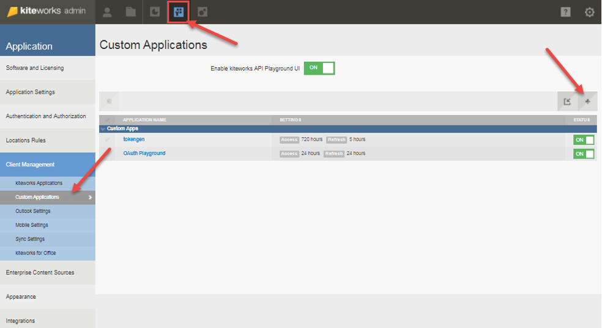
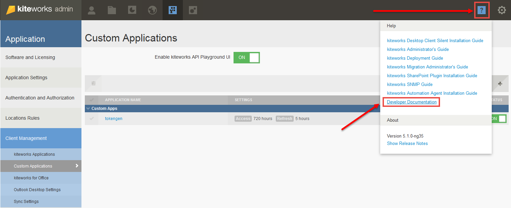
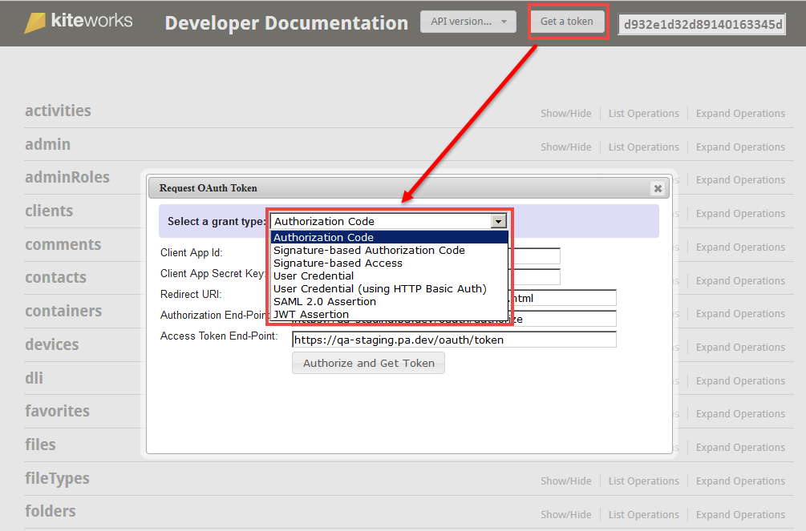

# Authentication
This section describes how to authenticate and get tokens to start making API calls. Perform the following steps to authenticate and start your custom application development.

Step 1. Sign in to kiteworks.

&nbsp;&nbsp;&nbsp;&nbsp;&nbsp;&nbsp; Once you have your instance of kiteworks up and running, sign in to the kiteworks admin interface with your user credentials. The admin interface can be accessed from the hostname of your kiteworks server/admin.

Step 2. Create your custom application to obtain the identifying information: the Client ID and Secret Key.

&nbsp;&nbsp;&nbsp;&nbsp;&nbsp;&nbsp; On the kiteworks Administrator’s Dashboard, go to **Application** > **Client Management** > **Custom Applications** and add your custom application.

&nbsp;&nbsp;&nbsp;&nbsp;&nbsp;&nbsp; Specify a Custom Application Name. This name will be used by the Administrator for the Client Application Management and Reporting and in the Consent Form to authorize new users.

&nbsp;&nbsp;&nbsp;&nbsp;&nbsp;&nbsp; Select the authentication flow that your application will use to obtain an access token. Authorization Code- Standard OAuth 2.0 authorization-code consists of authorization, consent and the code redemption process.

&nbsp;&nbsp;&nbsp;&nbsp;&nbsp;&nbsp; Under Flows select **Authorization Code**.

&nbsp;&nbsp;&nbsp;&nbsp;&nbsp;&nbsp; Specify the **Redirect URI** using this format https://%%HOST%%/rest/callback.html

&nbsp;&nbsp;&nbsp;&nbsp;&nbsp;&nbsp; Choose your **Access Token Lifetime**.

Step 3. Add your Custom Application. You will be given the Client Application ID and Client Secret Key for your application.

&nbsp;&nbsp;&nbsp;&nbsp;&nbsp;&nbsp; **IMPORTANT:** You must copy this information and keep it in a secure location. The Client Secret Key is required for authenticating your app. If you lose this information, you will have to start over and re-register your app.

Step 4. Configure your Custom Application. The kiteworks APIs are used by the custom applications to access user resources on a kiteworks server.

The kiteworks APIs are used by the custom applications to access user resources on a kiteworks server.

**API Usage** – The APIs follow the REST architectural style and use the scheme of addressing a resource and invoking a method on that resource.

**The API URI** – All APIs can be called using the following URI scheme: https://<hostname>/rest/<resources>
  
**API Output** – The API result is returned in JSON format.

## Getting a Token

Perform the following steps to get a token:

Step 1: Click on the Help **?** icon and select **Developer Documentation** from the dropdown menu.

Step 2: Select the **Get a Token** button in the upper right corner of developer documentation page. An example of the token is shown in the upper right field on the Developer Documentation page below. This token is used for all requests sent out from this documentation page.

**NOTE:** Several of the “grant types” shown in the screenshot below are only usable in the API playground and will not display. Only Authorization Code, Signature-Based Authorization Code, and SAML 2.0 Assertion will display.

You can request a token from the following grant types:

*	Authorization Code

*	Signature-based Authorization Code

*	Signature-based Access

*	User Credential 

*	User Credential (using HTTP Basic Authorization)

*	SAML 2.0 Assertion

*	JWT Assertion

## kiteworks Authorization Code (OAuth 2.0 Flow)

The kiteworks APIs allows any new client application (client for short) to be developed for the kiteworks solution. The APIs can be used by the client to gain access to resources belonging to a user on the kiteworks server. The APIs can only be used by a client that is registered on the kiteworks server.

A client must provide an access token to access resources belonging to a user on the kiteworks server. The kiteworks server provides access token provisioning flows based on the OAuth 2.0 (https://tools.ietf.org/html/rfc6749). The majority of clients will consume the so-called Authorization Code Flow to obtain an access token. This flow is developed based on the authorization code grant type of the OAuth 2.0 specification.

This document provides a step-by-step guide for application developers to build a client for consuming the Authorization Code Flow to obtain an access token and use the access token to access users’ resources on a kiteworks server. Example codes for Android based clients are also provided

### Obtaining Access Token Requirements

For obtaining an access token using the kiteworks Authorization Code Flow, you need the client registration information recorded in the previous steps:

*	**client_id** – This is a unique system generated id of your client.

*	**client_secret** – This secret serves as a password for your client to authenticate itself to the kiteworks server.

*	**redirect URI** – This is the URI on which your client must listen for the authorization result. For mobile clients or for clients that cannot be redirected to another service, the landing page https://<kiteworks_server>/oauth_callback.php can be used.

*	 **scope** – This is the set of API services that your client wants to access. Consult with your administrator regarding which scopes are available for your client.

### Sequence Overview

The sequence of the Authorization Code Flow is as follows:

Step 1.	The client initiates the flow by redirecting the user-agent (browser or web view component) to the appropriate authorization page on the server. The client includes its ID and a redirect URI to which the server will send the user back once access is granted or denied.

Step 2.	The server authenticates the user using a login page similar to web client login page and establishes whether the user grants or denies the client's access request.

Step 3.	If the user grants access, the server redirects the user-agent to the redirection URI provided earlier. The URI also includes an authorization code that can be used to request an access token for that user.

Step 4.	The client requests an access token from the server by authenticating itself (using its ID and secret) and including the authorization code received in the previous step.

Step 5.	The server validates the client credentials and the authorization code and responds with the access token. The client uses the access token to invoke APIs for accessing user’s resources.

### Step-by-step Usage

The request-response of this flow follows the specification of OAuth 2.0 protocol (http://tools.ietf.org/html/rfc6749#section-4.1). All requests for authorization and for calling service must be done through HTTPS. The URI end-points of this flow are as follows:

*	Authorization end-point: https://<hostname>/oauth/authorize
  
*	Token end-point: https://<hostname>/oauth/token
  
All request parameters, unless otherwise specified, must be passed through HTTP POST parameters. The response body will be in JSON format. The following information describes this in more detail.

#### Step 1 Authorization Request

The first step is to call the Authorization end-point with the request parameters passed via HTTP GET. Depending on the case, the user may be prompted with a dialog to authenticate and then to authorize the request for access permission by the client application. The following parameters must be passed in the request to the Authorize URI (this follows the OAuth 2 specification).

*	**client_id** – is the identifier of the client-application as registered in the server. For example ‘playground’.

*	**redirect_uri** – is the URI to which the result of the authorization will be passed. This redirect URI must start with the URI specified at the time of the creation/registration of the client application. For example, if the client application had registered with the redirect URI of https://mydomain.com/oauth then the client application may provide https://mydomain.com/oauth/callback as redirect_uri parameter in this request. Note, that this parameter must be properly URL-encoded.

*	**response_type** – the value of this parameter must be set to “code”.

*	**scope** – is the scope of the API services that the client wants to access. This is a space-separated string consisting of the name of the method and API services that the application requires. For example: “GET/users/  /files/”. The requested scope must be a sub-set of the client application's registered scope in the server. If a blank scope is provided, the registered scope will be assumed.

*	**m** (optional parameter) – set to 1 to display mobile friendly authorization page.

*	**state** (optional parameter) – is an optional parameter that the client application may pass in order to maintain the state of its process. The server will pass back this parameter as-is in the response. 

Code Example on the right:
(Note that line break is used only for clarity)

> GET https://kiteworks_server/oauth/authorize?

> client_id=abc&response_type=code&scope=&redirect_uri= https%3A%2F%2Fkiteworks_server%2Foauth_callback.php HTTP/1.1 

  

  

**Successful Response**

After the server finishes the authorization and authentication procedure with the user, the server will redirect the user (via HTTP 302) to the redirect_uri provided in the Authorize call. Two parameters will be passed through this redirection URI: code and state. The code parameter is the authorization code that can be used to obtain the access token in the second step.

Code Example on the right:

> HTTP/1.1 302 Found 

> Location: https://kiteworks_server/oauth_callback.php?code=60cc146c8dced75e26e 

  

  

**Error Response**

If an error occurs (such as invalid consumer id, or invalid redirect URI), an error message will be displayed immediately within the user’s browser. For other errors (such as invalid scope or denied access by the user) the server will redirect the user (via HTTP302) to the redirect_URI. The parameters are:

•	error – is the error code. The following are the possible values of the error code:

&nbsp;&nbsp;&nbsp;&nbsp;&nbsp;&nbsp; o	**access_denied:** The user denied the permission request.

&nbsp;&nbsp;&nbsp;&nbsp;&nbsp;&nbsp; o	**invalid_scope:** The requested scope is invalid.

&nbsp;&nbsp;&nbsp;&nbsp;&nbsp;&nbsp; o	**invalid_request:** The request is missing a required parameter, includes an unsupported parameter or parameter value, or is otherwise malformed.

&nbsp;&nbsp;&nbsp;&nbsp;&nbsp;&nbsp; o	**unauthorized_client:** The client-application is not authorized to use this flow.

&nbsp;&nbsp;&nbsp;&nbsp;&nbsp;&nbsp; o	**state** – is set to the exact

Code Example on the right:

> HTTP/1.1 302 Found 

> Location: https:// kiteworks_server/oauth_callback.php?error=access_denied 

