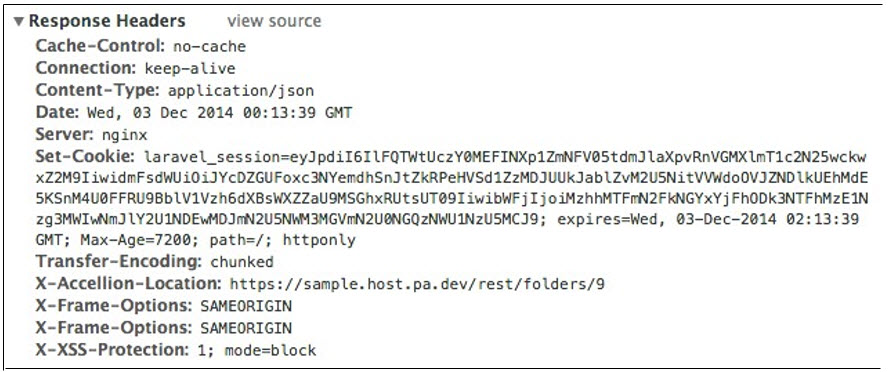
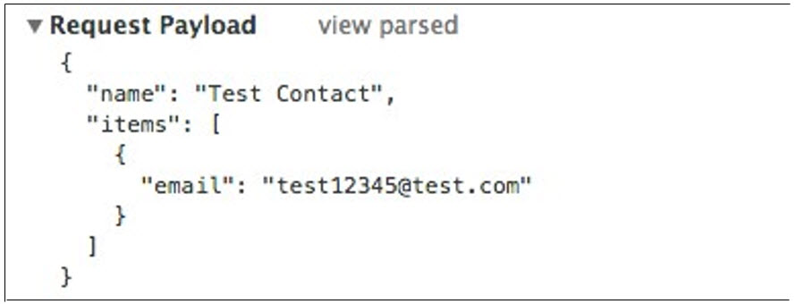
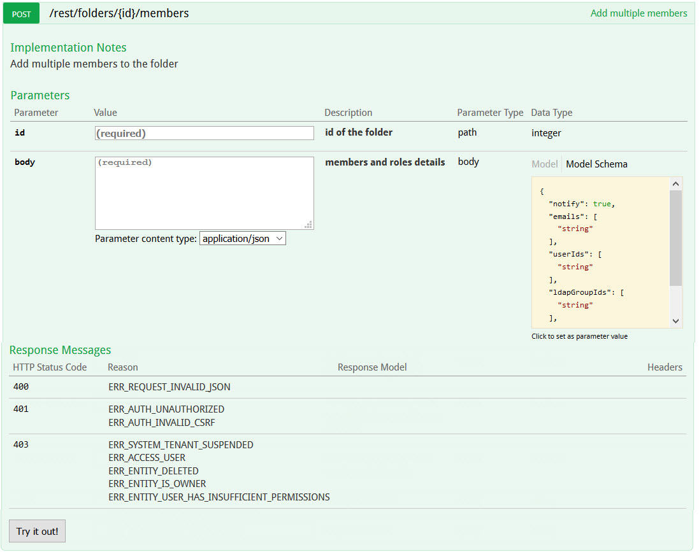

# Creating Objects

Now that we have been able to get the **id** of the **My Folder** folder and grab the associated JSON object, let's try to actually create a folder inside of this one. This will, again, require the **id** of the folder, which we already have.

If you look at the developer documentation website, you will see that there is an endpoint under **folders** that is used to create a new folder.

The parent id expected in this request is the id of the folder that we want to create our new folder in.

As a creation request for the API, this endpoint also requires some information for the object you wish to create. The developer documentation outlines the format that this information should be provided in. This can be found under the Data Type of the body parameter. In this case, a name is the only requirement. The required information is expected to be in the Request Payload of the request.   There are also options to add description and specify if the folder is syncable. If these options are used, that information should also be included in the Request Payload.

Please note that the **Request Payload** is expected to be JSON and that the Content-Type must be **application/json**.

Upon success, the response's header will look something like this.

The most noteworthy part of this response is the **X-Accellion-Location** field. This was mentioned before as an indicator of which object is being acted upon. In the case of creating an object, this will be the new object that you have created. This will also be a way to get the **id** of the object, for future use.

Now that we have created a folder, let us add one of your contacts as a downloader.

If you don't have any contacts or you wouldn't like to share this folder with any of your existing contacts, you can use the **POST /rest/contacts** endpoint under the **contacts** entity to create another contact

For this endpoint, you will need to supply a contact name and an email address. The **Request Payload** should look like this.

Again, make note of the **X-Accellion-Location** field in the response header, where you can find the **id** for the contact that was created. This **id** will be used in the next endpoint we use.

Use the **GET /rest/contacts/{id}** endpoint, filling in the necessary **id** with the one we took from the last response header, to get the information for this contact

Inside the response for this endpoint, there is an **Items** array, and the first element of that array contains a **links** array. That array contains an element that has a field called **entity** with the value **user**. This indicates that the data in this element corresponds to the **user** that is associated with this **contact**. Inside that element, there should also be an **id** field. This is more clearly shown in the next figure.

The value of that id will be what we will use in our next web request's **Request Payload**.

Now that you have a contact that you would like to add to this folder, let's actually add him as a downloader. Under the **folders** entity, there is a **POST /rest/folders/{id}/members** entity. In the actual request, the **id** is the **id** of the folder you want to add the user to. In this case, it would be the **id** of the folder we created earlier in **My Folder**.

The **Request Payload** for this web request should contain both the **userId** for the contact you want to add (which we obtained from the previous web request) and the **roleId**. A comprehensive list of every role and associated **roleId** can be obtained through the **GET /rest/roles** endpoint under the **roles** entity.

From the response of this web request, we can observe that a downloader's corresponding role Id is 2. The **Request Payload** should be formatted as follows.

After successfully performing this, you have created a folder and added a contact to it as a downloader. Now, this contact has visibility into this folder and the ability to download files from it. 
