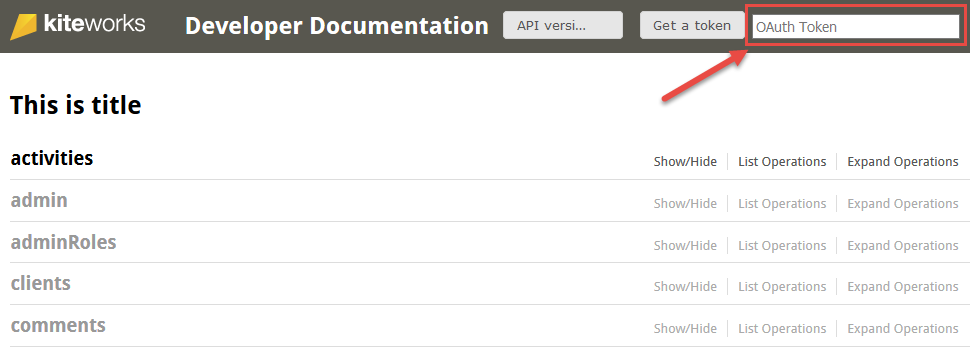
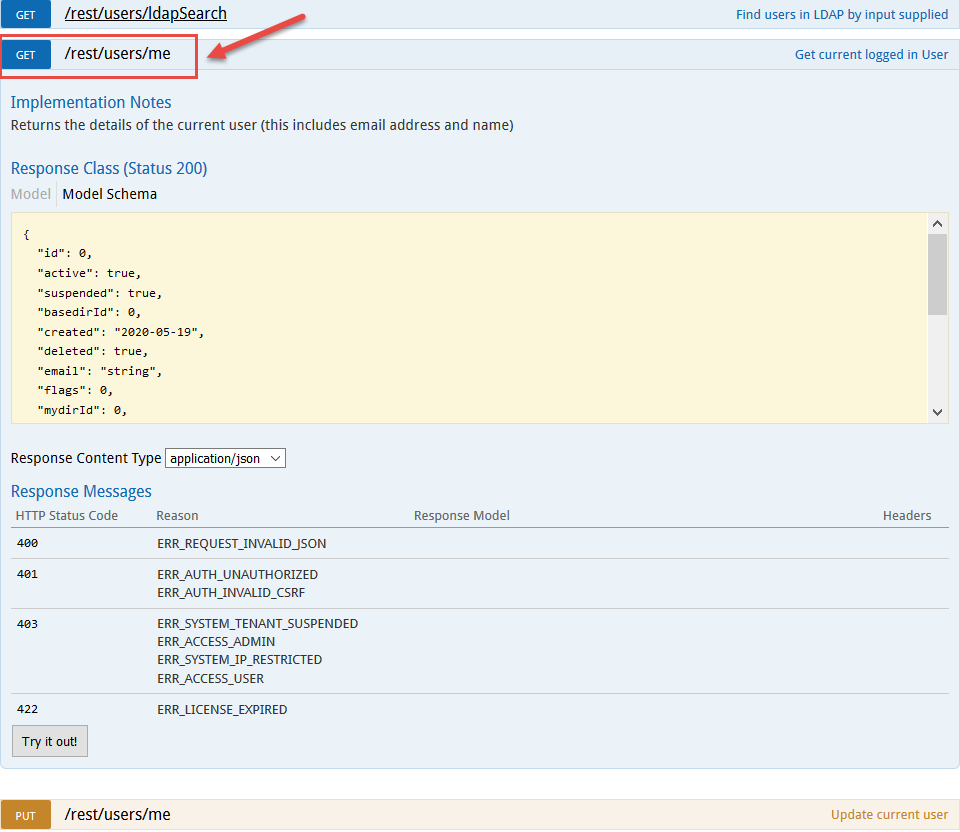
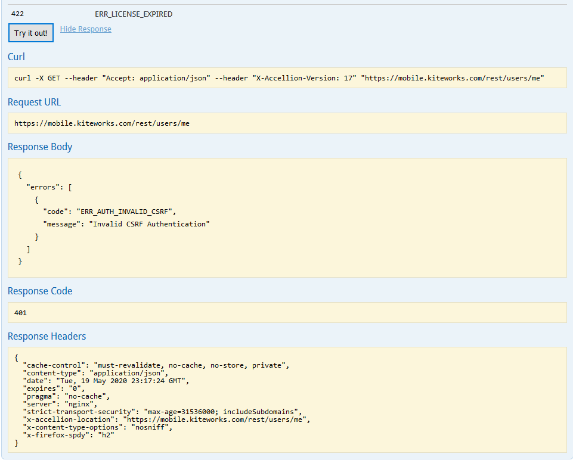

# Execute API Calls

Once the access token is obtained, you will need to paste it in the **OAuth Token** field as shown below.

Now, you can start using the kiteworks API in your application. 

## Performing a Basic API Call
A list of entities, each of which correspond to a different feature of kiteworks is represented with a JSON payload. When an entity name is clicked, the interface expands to show all of the endpoints associated with that entity. An endpoint is a web request that performs a task related to the entity it falls under.  
As an example, shown below is the **users** entity.

Here, you can see the list of endpoints associated with the **users** entity. For clarity purposes, they are color coded based on what method is being used. To the right of each list item, there is a brief description of what the entity does.  
When an item in this list is clicked, the interface expands to show the information relevant to the selected endpoint.

Click on the endpoint **GET /rest /users/me**.

You can go over the details for this endpoint. In summary, it returns a JSON representation of the entity that is populated with information that the access token represents. This information is tied to the current user. After going  over the information for the endpoint, click the **Try it out!** button.  

In the **Response Body** section, there will be a JSON object of the **users** class, and it will contain the current user's information.
