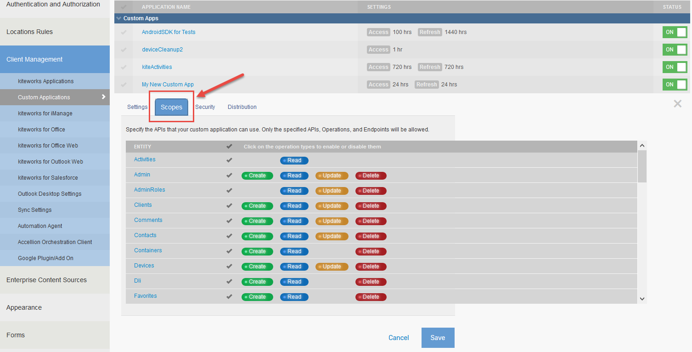
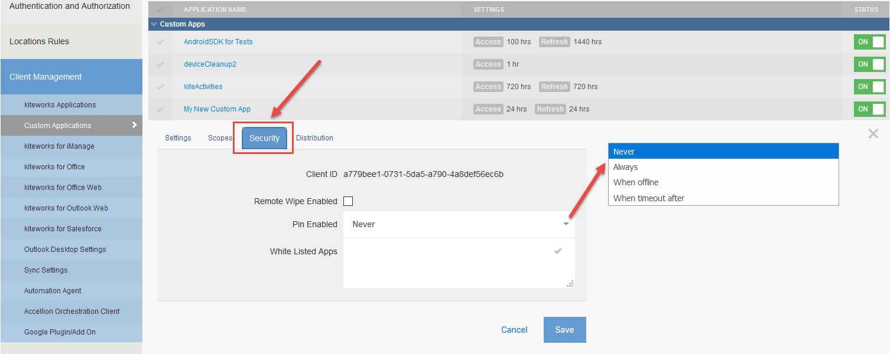

# Getting Started
To start your custom application development, perform the steps below. 
1.	Sign in to kiteworks. 
Once you have your instance up and running, sign in to the Accellion admin interface with your user credentials. The admin interface can be accessed from the hostname of your Accellion server /admin.
2.	Create your custom application to obtain the identifying information: the Client ID and Secret Key.

# Custom Applications
Custom applications can be used to automate business workflows, for example, on-boarding new Accellion users to access relevant folders automatically. Accellion APIs are used to develop custom applications. On the **Custom Application** page a list with all the custom applications that already exist on the system is displayed.

Perform the following steps to create a Custom Application:  
1. Create a new Custom Application.   
    a. Go to **Applications** > **Client Management** > **Custom Applications** and click the **+** icon to create a new custom application.  
    b. Enter the following information:  
  **Name**: Enter a name for your custom application.  
  **Description**: Enter a description for your application.  
  **Flows**: Select the authorization flow that your application will use to obtain an access token.  
       **Authorization Code**: standard OAuth 2.0 authorization-code grant type consists of authorization, consent, and code redemption process.  
      **Signature Authorization**: use this flow when the registered client can verify the identity of the user. This flow should only be used for trusted applications. You can choose to either generate a random signature key or manually enter the key.  
      **User Credentials**: use this flow to allow the registered client to obtain the access token by providing the user's username and password. This flow should only be used for trusted applications that cannot use a Web Form based login, but need the user to authenticate with their username/password, e.g., any command line based utilities. This flow follows the Resource Owner Password Credentials Grant specified in RFC 6749.  
  **Enable Refresh Token**: If enabled, when an access token expires, a new access token can be obtained using a refresh token without re-initiating the authorization process.  
  **Redirect URI**: Specify the Redirect URI using this format <https://%%HOST%%/rest/callback.html>  
  **Access Token Lifetime**: Set the duration of a token lifetime.  
  **Refresh Token Lifetime**: Set the duration that an access token can be refreshed.  
  c. 	Click **Add Application**.    
  
  
  d. The Add Client Application dialog box will show the **Client Application ID**, **Client Secret Key** and the **Signature Secret**. Record the information in a secure location.   

  > **CAUTION** The Client Application ID and Client Secret Key cannot be changed and should be protected, since these credentials could be used to access Accellion systems, potentially exposing these systems to loss or theft of critical information. The Administrator is responsible for keeping these credentials safe and should only share them with trusted individuals.

    **IMPORTANT**: You must copy this information and keep it in a secure location. The Client Secret Key is required for authenticating your app. If you lose this information, you will have to start over and re-register your app.   

    

2. Click **OK**. The application you just created will display on the Custom Applications page.  

  

3. Select the Application Name you just created, and customize the **Settings**, **Scopes**, **Security** and **Distribution** tabs.  

**NOTE** 

For more information, go to the Developer Portal at <https://developer.kiteworks.com> to download a demo and view the Developer Guide.  
  
4. **Settings** tab: You can make changes to the settings, if desired.

   

5. **Scopes**: Scopes are defined limits to client applications for accessing data. By selecting the appropriate scopes for the application, clients can enable or restrict certain tasks to be performed by a user or on behalf of an Accellion user.  

Every custom application that is created can have server-side authorization scopes. You can define on the server what endpoints the custom application is allowed to use and how it can use those endpoints. Select the APIs you plan to use for your custom application. By default, all APIs are selected when you first create the application.   

   

6. **Security** tab: 
**Remote Wipe Enabled**:  
Enable Remote Wipe for this application.  
**Pin Enabled**:  
Specify whether a PIN should be enabled for this application. Recommended for mobile apps.  
**White Listed Apps**:
List third-party mobile apps that can be used to open files via the Open-In menu.  

   

Select **Save Changes**.  
You are now ready to test your application. Go to 
<https://< your kiteworks hostname > /rest/index.html> to test your app using the app credentials. 
Note 	“your kiteworks hostname” is the name of your Accellion deployment.  

7. **Distribution**:   
You can distribute your application and export the application package by clicking **Export App**.  

 
