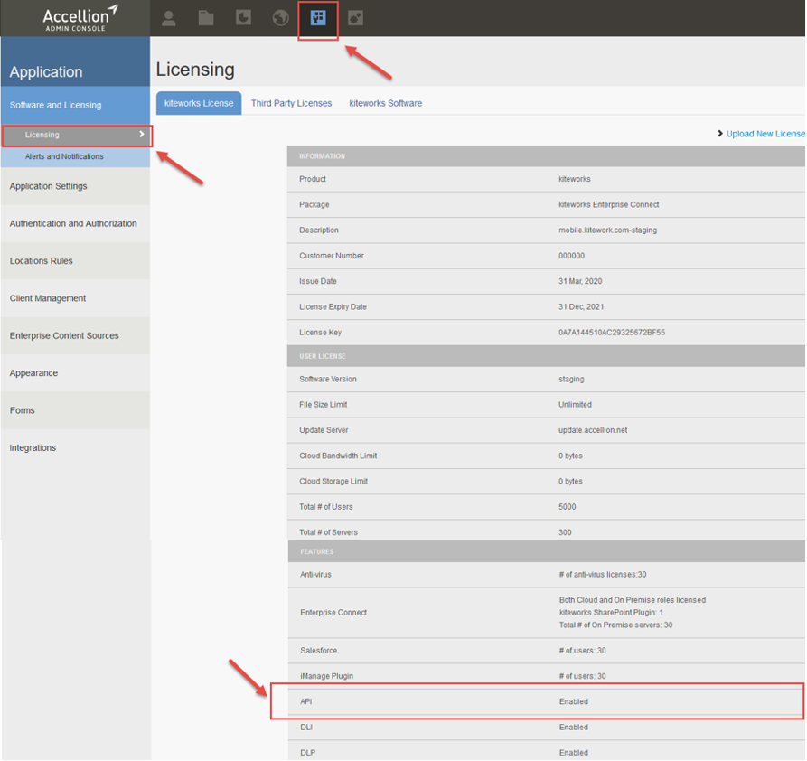
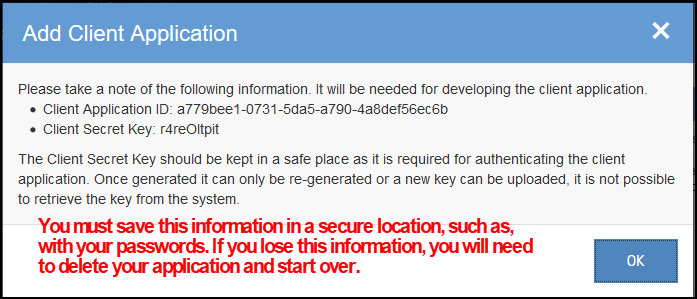
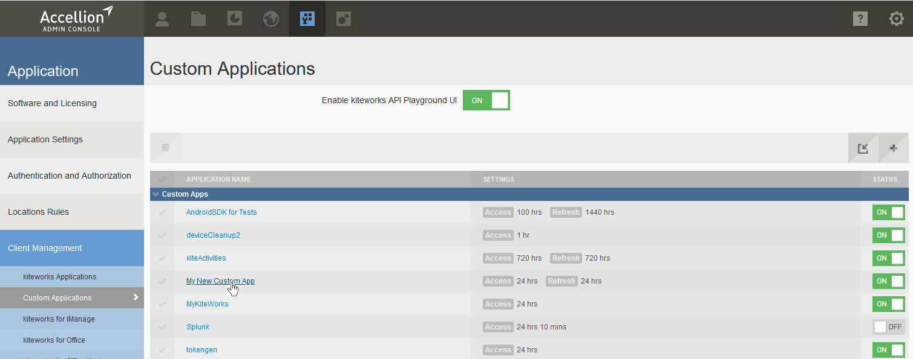

# Prerequisites
It is assumed that the reader is familiar with the following concepts and technologies used within the Accellion API framework:
*	Representational State Transfer (REST) architectural styles  
*	RESTful style constraints and implementation
*	OAuth 2.0 Protocol
*	JavaScript Object Notation (JSON) format and structure
*	Hypertext Transfer Protocol (HTTP) terminology, methods, and status codes
*	Multipart MIME (Multipurpose Internet Mail Extensions) requests

# Get an Accellion instance
You will need an Accellion instance to get access to the API. If you don't already have one, please click on the button below:

# Licensing
The RESTAPI is available on every Accellion Enterprise package that has the Automation Suite enabled.

Perform the following two steps to see if you have a license for the Accellion APIs:
1.	Log into an Accellion system and click on the Application icon as shown below. 
2.	Click on Licensing on the left panel.
The API is listed in the Features section and it will be enabled if you have an Accellion Enterprise package.   

# Enabling the Accellion API Playground
Perform the following steps to enable the Accellion API Playground:
1.	Click on the Application > Client Management > Custom Applications as shown below. 
2.	Click on Enable kiteworks API Playground UI  ON/OFF switch to enable it if it not enabled.
A confirmation window displays, click OK to enable the playground.

# Getting Started
To start your custom application development, perform the steps below. 
1.	Sign in to kiteworks. 
Once you have your instance up and running, sign in to the Accellion admin interface with your user credentials. The admin interface can be accessed from the hostname of your Accellion server /admin.
2.	Create your custom application to obtain the identifying information: the Client ID and Secret Key.

# Custom Applications
Custom applications can be used to automate business workflows, for example, on-boarding new Accellion users to access relevant folders automatically. Accellion APIs are used to develop custom applications. On the **Custom Application** page a list with all the custom applications that already exist on the system is displayed.

Perform the following steps to create a Custom Application:  
1. Create a new Custom Application.   
    a. Go to **Applications** > **Client Management** > **Custom Applications** and click the **+** icon to create a new custom application.  
    b. Enter the following information:  
  **Name**: Enter a name for your custom application.  
  **Description**: Enter a description for your application.  
  **Flows**: Select the authorization flow that your application will use to obtain an access token.  
       **Authorization Code**: standard OAuth 2.0 authorization-code grant type consists of authorization, consent, and code redemption process.  
      **Signature Authorization**: use this flow when the registered client can verify the identity of the user. This flow should only be used for trusted applications. You can choose to either generate a random signature key or manually enter the key.  
      **User Credentials**: use this flow to allow the registered client to obtain the access token by providing the user's username and password. This flow should only be used for trusted applications that cannot use a Web Form based login, but need the user to authenticate with their username/password, e.g., any command line based utilities. This flow follows the Resource Owner Password Credentials Grant specified in RFC 6749.  
  **Enable Refresh Token**: If enabled, when an access token expires, a new access token can be obtained using a refresh token without re-initiating the authorization process.  
  **Redirect URI**: Specify the Redirect URI using this format <https://%%HOST%%/rest/callback.html>  
  **Access Token Lifetime**: Set the duration of a token lifetime.  
  **Refresh Token Lifetime**: Set the duration that an access token can be refreshed.  
  c. 	Click **Add Application**.    
  
  
  d. The Add Client Application dialog box will show the **Client Application ID**, **Client Secret Key** and the **Signature Secret**. Record the information in a secure location. 
 
 ---
 
  > **CAUTION** The Client Application ID and Client Secret Key cannot be changed and should be protected, since these credentials could be used to access Accellion systems, potentially exposing these systems to loss or theft of critical information. The Administrator is responsible for keeping these credentials safe and should only share them with trusted individuals.
---
---

 > **IMPORTANT**: You must copy this information and keep it in a secure location. The Client Secret Key is required for authenticating your app. If you lose this information, you will have to start over and re-register your app.
---  
    

2. Click **OK**. The application you just created will display on the Custom Applications page.  

  

3. Select the Application Name you just created, and customize the **Settings**, **Scopes**, **Security** and **Distribution** tabs.  
---
 
  > **NOTE** For more information, go to the Developer Portal at <https://developer.kiteworks.com> to download a demo and view the Developer Guide. 
---	
  
4. **Settings** tab: You can make changes to the settings, if desired.

   

5. **Scopes**: Scopes are defined limits to client applications for accessing data. By selecting the appropriate scopes for the application, clients can enable or restrict certain tasks to be performed by a user or on behalf of an Accellion user.  

Every custom application that is created can have server-side authorization scopes. You can define on the server what endpoints the custom application is allowed to use and how it can use those endpoints. Select the APIs you plan to use for your custom application. By default, all APIs are selected when you first create the application.   

 

## Setup your first custom app
If you already have an Accellion instance:

1. Sign in to the Admin interface at https://[hostname]/admin. Replace [hostname] with your Accellion instance hostname.
2. Click on the Application tab icon using the top navigation bar.
3. Click on Client Management in the left navigation panel. **NOTE**: If you see the Custom Applications section under Client Management, you have everything you need to get started. Otherwise, please email <support@accellion.com> to request API access for your instance.
4. Click on Custom Applications under Client Management.
5. Click on the + button to add your custom app. Further steps below the screenshot.

6. Fill up the Add Custom Application form as per your needs. Our example app will use standard OAuth 2.0 Authorization Code flow with refresh token. **NOTE**: If you want to test this app in the playground, set the Redirect URI to https://%%HOST%%/rest/callback.html. After testing, this should be changed to your app's own redirect URI.

7. Click on the Add Application button.
8. Copy and save the Client Application ID and Client Secret Key from the popup to a secure location. **NOTE**: This is your only chance to copy the secret key.
9. Click OK. Your custom application is now created and you are ready to start experimenting in the playground.

## Get a token
Once the playground has loaded (resource list has been fetched), click the **Get a token** (1) button near the top right.

You can request a token from the following grant types:
*	Authorization Code
*	Signature-based Authorization Code
*	Signature-based Access
*	User Credential 
*	User Credential (using HTTP Basic Authorization)
*	SAML 2.0 Assertion
*	JWT Assertion

In the popup form, **Authorization Code** grant type is selected by default. Enter the **Client App ID** and **Client App Secret Key** (2) of the custom app you created in the previous section.
Click **Authorize and Get Token** (3).

Click "Grant Access" in the new End-User Authorization popup. The playground will receive a token from the Accellion server and display it in the top right. You are now ready to make your first API call from the playground.

## Call an endpoint
Now that the playground has the access token, it is time to perform a basic API call.

On the playground webpage, you will see several categories like activities, admin, etc. Clicking on a category name expands it, showing all the endpoints in it. The categories are arranged alphabetically.

Scroll down and click the **users** category.

The endpoints are color coded based on the HTTP method. To the right of each endpoint, there is a brief description of its purpose.

Click on the endpoint **GET /rest/users/me** to see more details about it.

Click the **Try it out!** button. In the **Response Body** section, you will see a JSON object of the **users** class, and it will contain the current user's information.

