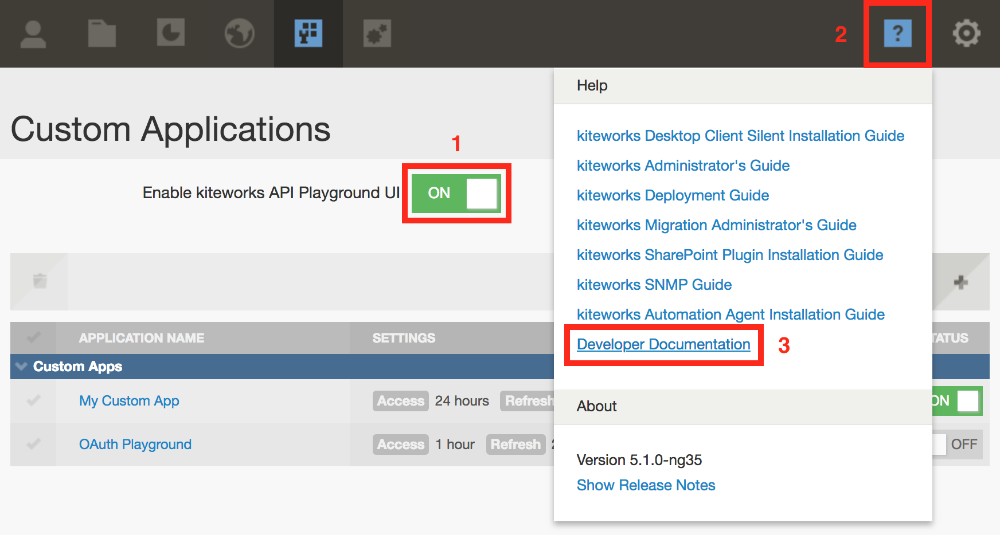

# Setup

## Prerequisites
You should be an experienced developer and have an understanding of the following concepts and technologies:

* OAuth 2.0
* JSON data format
* HTTP methods and status codes
* REST APIs

## Get an Accellion instance
You will need an Accellion instance to get access to the API. If you don't already have one, please click on the button below:

## Setup your first custom app
If you already have an Accellion instance:

1. Sign in to the Admin interface at https://[hostname]/admin. Replace [hostname] with your Accellion instance hostname.
2. Click on the Application tab icon using the top navigation bar.
3. Click on Client Management in the left navigation panel. **NOTE**: If you see the Custom Applications section under Client Management, you have everything you need to get started. Otherwise, please email <support@accellion.com> to request API access for your instance.
4. Click on Custom Applications under Client Management.
5. Click on the + button to add your custom app. Further steps below the screenshot.

6. Fill up the Add Custom Application form as per your needs. Our example app will use standard OAuth 2.0 Authorization Code flow with refresh token. **NOTE**: If you want to test this app in the playground, set the Redirect URI to https://%%HOST%%/rest/callback.html. After testing, this should be changed to your app's own redirect URI.

7. Click on the Add Application button.
8. Copy and save the Client Application ID and Client Secret Key from the popup to a secure location. **NOTE**: This is your only chance to copy the secret key.
9. Click OK. Your custom application is now created and you are ready to start experimenting in the playground.

## Setup the playground
1. On the Custom Applications page in Admin interface, turn the API playground ON. Click OK in the confirmation popup.
2. Click the "?" icon near the top right.
3. Click "Developer Documentation". This should open the playground in a new tab.

