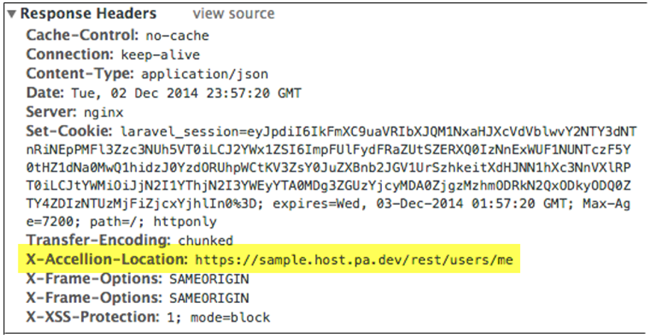

# Using API Requests

In the response header shown below, the field called X-Accellion-Location, indicates what object is being acted upon. 
NOTE:  In the case of an error, this field might not indicate the object being acted upon.  

In this example the object being acted upon is the current user. In this case, the information about this user is just being returned. However, when adding, removing, updating, or otherwise editing objects, it is critical to make note of which object is being acted upon.  

The response of the request is the JSON object. Here, it is important to note that every object has an id element, which is the unique identifier for the object with respect to all other objects of that entity type. Most of the endpoints that get and/or modify a specific data will require the id of the object that corresponds to the data.  

